# 04-domain.md — medipanda-api 도메인 모델 분석

**기준일**: 2026-04-27
**대상**: `/Users/jmk0629/keymedi/medipanda-api`
**DB**: PostgreSQL (패키지명 `entity.postgresql` 으로 명시)

---

## 도메인 모델 요약

| 항목 | 수치 |
|------|------|
| @Entity 클래스 | 45개 |
| @MappedSuperclass | 1개 (BaseEntity) |
| @Embeddable (내부 클래스 포함) | 1개 (Member.MarketingAgreement) |
| @Convert (커스텀 컨버터) | 1개 (TemplateCodeConverter) |
| Enum (sealed interface 포함) | 38개 |
| 추정 Aggregate | 6개 |
| 도메인 핵심 키워드 | Member, Dealer, Partner, Prescription, Settlement, ExpenseReport, BoardPost, Product, DrugCompany |

---

## 1. @Entity 전수 + 테이블명 매핑 표

| # | 클래스명 | 테이블명 | ID 전략 | BaseEntity 상속 | 파일 |
|---|----------|----------|---------|-----------------|------|
| 1 | Member | member | IDENTITY | O | Member.kt:13 |
| 2 | MemberFile | member_file | IDENTITY | X | MemberFile.kt:6 |
| 3 | MemberBlock | member_block | IDENTITY | O | MemberBlock.kt:6 |
| 4 | MemberDevice | member_device | IDENTITY | O | MemberDevice.kt:11 |
| 5 | MemberPushPreference | member_push_preference | IDENTITY | O | MemberPushPreference.kt:7 |
| 6 | Dealer | dealer | IDENTITY | O | Dealer.kt:5 |
| 7 | DealerDrugCompany | dealer_drug_company | IDENTITY | O | DealerDrugCompany.kt:6 |
| 8 | DrugCompany | drug_company | IDENTITY | O | DrugCompany.kt:7 |
| 9 | Partner | partner | IDENTITY | O | Partner.kt:8 |
| 10 | PartnerContract | partner_contract | IDENTITY | O | PartnerContract.kt:9 |
| 11 | PartnerContractApprovalHistory | partner_contract_approval_history | IDENTITY | O | PartnerContractApprovalHistory.kt:7 |
| 12 | PartnerContractFile | partner_contract_file | IDENTITY | X | PartnerContractFile.kt:7 |
| 13 | PartnerPharmacy | partner_pharmacy | IDENTITY | O | PartnerPharmacy.kt:7 |
| 14 | Prescription | prescription | IDENTITY | O | Prescription.kt:8 |
| 15 | PrescriptionPartner | prescription_partner | IDENTITY | X | PrescriptionPartner.kt:7 |
| 16 | PrescriptionPartnerProduct | prescription_partner_product | IDENTITY | X | PrescriptionPartnerProduct.kt:6 |
| 17 | PrescriptionPartnerProductOcr | prescription_partner_product_ocr | IDENTITY | X | PrescriptionPartnerProductOcr.kt:6 |
| 18 | PrescriptionEdiFile | prescription_edi_file | IDENTITY | X | PrescriptionEdiFile.kt:6 |
| 19 | Settlement | settlement | IDENTITY | O | Settlement.kt:6 |
| 20 | SettlementPartner | settlement_partner | IDENTITY | X | SettlementPartner.kt:5 |
| 21 | SettlementPartnerProduct | settlement_partner_product | IDENTITY | X | SettlementPartnerProduct.kt:6 |
| 22 | SettlementMemberMonthly | settlement_member_monthly | IDENTITY | X (직접 @EntityListeners) | SettlementMemberMonthly.kt:9 |
| 23 | Product | product | IDENTITY | O | Product.kt:9 |
| 24 | ProductExtraInfo | product_extra_info | IDENTITY | O | ProductExtraInfo.kt:6 |
| 25 | ExpenseReport | expense_report | IDENTITY | O | ExpenseReport.kt:9 |
| 26 | ExpenseReportBriefingSingle | expense_report_briefing_single | IDENTITY | X | ExpenseReportBriefingSingle.kt:14 |
| 27 | ExpenseReportBriefingMulti | expense_report_briefing_multi | IDENTITY | X | ExpenseReportBriefingMulti.kt:14 |
| 28 | ExpenseReportMedicalPerson | expense_report_medical_person | IDENTITY | X | ExpenseReportMedicalPerson.kt:15 |
| 29 | ExpenseReportMultiInstitution | expense_report_multi_institution | IDENTITY | X | ExpenseReportMultiInstitution.kt:20 |
| 30 | ExpenseReportSampleProvide | expense_report_sample_provide | IDENTITY | X | ExpenseReportSampleProvide.kt:7 |
| 31 | ExpenseReportFile | expense_report_file | IDENTITY | X | ExpenseReportFile.kt:6 |
| 32 | Hospital | hospital | SEQUENCE (seq_hospital, alloc=50) | O | Hospital.kt:20 |
| 33 | RegionCategory | region_category | IDENTITY | O | RegionCategory.kt:6 |
| 34 | BoardPost | board_post | IDENTITY | O | BoardPost.kt:9 |
| 35 | BoardPostFile | board_post_file | IDENTITY | X | BoardPostFile.kt:6 |
| 36 | BoardPostLike | board_post_like | IDENTITY | X | BoardPostLike.kt:6 |
| 37 | BoardPostView | board_post_view | IDENTITY | O | BoardPostView.kt:6 |
| 38 | BoardComment | board_comment | IDENTITY | O | BoardComment.kt:10 |
| 39 | BoardCommentLike | board_comment_like | IDENTITY | X | BoardCommentLike.kt:6 |
| 40 | BoardStatistics | board_statistics | IDENTITY | X | BoardStatistics.kt:5 |
| 41 | BoardNotice | board_notice | IDENTITY | X | BoardNotice.kt:9 |
| 42 | EventBoard | event_board | IDENTITY | O | EventBoard.kt:6 |
| 43 | SalesAgencyProductBoard | sales_agency_product_board | IDENTITY | O | SalesAgencyProductBoard.kt:6 |
| 44 | SalesAgencyProductApplication | sales_agency_product_application | IDENTITY | O | SalesAgencyProductApplication.kt:6 |
| 45 | S3File | s3_file | IDENTITY | O | S3File.kt:9 |
| 46 | Banner | banner | IDENTITY | O | Banner.kt:11 |
| 47 | BannerFile | banner_file | IDENTITY | X | BannerFile.kt:7 |
| 48 | NotificationTemplate | notification_template | IDENTITY | X | NotificationTemplate.kt:9 |
| 49 | Terms | terms | IDENTITY | O | Terms.kt:7 |
| 50 | KmcAuthSession | kmc_auth_session | IDENTITY | O | KmcAuthSession.kt:9 |
| 51 | AdminPermissionMeta | admin_permission_meta | IDENTITY | X | AdminPermissionMeta.kt:7 |
| 52 | AdminPermissionMapping | admin_permission_mapping | IDENTITY | O | AdminPermissionMapping.kt:5 |

**BaseEntity** (`BaseEntity.kt:12`): `@MappedSuperclass`, `@EntityListeners(AuditingEntityListener::class)`, `createdAt` / `modifiedAt` (`LocalDateTime`, nullable = false)

---

## 2. Enum 전수

| Enum | 값 목록 | 파일 |
|------|---------|------|
| AccountStatus | ACTIVATED, BLOCKED, DELETED | AccountStatus.kt:3 |
| MemberType | NONE, CSO, INDIVIDUAL, ORGANIZATION | MemberType.kt:3 |
| ContractStatus | CONTRACT, NON_CONTRACT | MemberType.kt:10 |
| Role | USER(0), ADMIN(200), SUPER_ADMIN(300) | Role.kt:3 |
| Gender | MALE, FEMALE | Gender.kt:3 |
| PrescriptionStatus | PENDING(접수대기), IN_PROGRESS(접수완료), COMPLETED(승인완료) | PrescriptionStatus.kt:3 |
| PrescriptionType | INDIVIDUAL(개별), BUNDLE(묶음) | PrescriptionType.kt:3 |
| PrescriptionPartnerStatus | PENDING(접수대기), IN_PROGRESS(접수완료), COMPLETED(승인완료) | PrescriptionPartnerResponse.kt:66 |
| SettlementStatus | REQUEST(정산요청), OBJECTION(이의신청) | SettlementStatus.kt:3 |
| PartnerContractStatus | PENDING, APPROVED, REJECTED, CANCELLED | PartnerContractStatus.kt:3 |
| PartnerContractType | INDIVIDUAL, ORGANIZATION | PartnerContractType.kt:3 |
| PartnerContractFileType | BUSINESS_REGISTRATION, SUBCONTRACT_AGREEMENT, CSO_CERTIFICATE, SALES_EDUCATION_CERT | PartnerContractFileType.kt:3 |
| PharmacyStatus | NORMAL, CLOSED, DELETED, NONE | PharmacyStatus.kt:3 |
| ContractType | VIOLATION, INFRINGEMENT, MISCONDUCT, OTHER | ContractType.kt:3 |
| ExpenseReportType | SAMPLE_PROVIDE, PRODUCT_BRIEFING_MULTI, PRODUCT_BRIEFING_SINGLE | ExpenseReportType.kt:3 |
| ExpenseReportStatus | PENDING, COMPLETED | ExpenseCategory.kt:11 |
| ExpenseReportFileType | SIGNATURE, ATTACHMENT | ExpenseReportFileType.kt:3 |
| ExpenseCategory | DRUG, DEVICE | ExpenseCategory.kt:3 |
| InstitutionType | SINGLE, MULTI | ExpenseCategory.kt:7 |
| BoardType | ANONYMOUS, MR_CSO_MATCHING, NOTICE, INQUIRY, FAQ, CSO_A_TO_Z, EVENT, SALES_AGENCY, PRODUCT | BoardType.kt:3 |
| ExposureRange | ALL, CONTRACTED, UNCONTRACTED | ExposureRange.kt:3 |
| NoticeType | PRODUCT_STATUS, MANUFACTURING_SUSPENSION, NEW_PRODUCT, POLICY, GENERAL, ANONYMOUS_BOARD, MR_CSO_MATCHING | NoticeType.kt:3 |
| NoticeTarget | DRUG_COMPANY_CONTRACTED_MEMBERS, ALL_MEMBERS | NoticeType.kt:14 |
| BannerStatus | VISIBLE, HIDDEN | BannerStatus.kt:3 |
| BannerScope | ENTIRE, CONTRACT, NON_CONTRACT | BannerStatus.kt:20 |
| BannerPosition | ALL, POPUP, PC_MAIN, PC_COMMUNITY, MOBILE_MAIN | Banner.kt:77 |
| EventStatus | IN_PROGRESS, FINISHED | EventStatus.kt:3 |
| ProductStatus | PROMOTION, OUT_OF_STOCK, STOP_SELLING | ProductStatus.kt:3 |
| PriceUnit | KRW, USD, EUR | PriceUnit.kt:3 |
| FileStatus | UPLOADING, COMPLETED, FAILED | FileStatus.kt:3 |
| S3PrefixKey | DEFAULT, MEMBER, EDI, BANNER, POST_ATTACHMENT, POST_EDITOR_ATTACHMENT, PARTNER_CONTRACT, EVENT_THUMBNAIL, SALES_AGENCY_PRODUCT_THUMBNAIL, EXPENSE_REPORT_ATTACHMENT, EXPENSE_REPORT_SIGNATURE | S3PrefixKey.kt:3 |
| MemberFileType | CONTRACT, CSO_CERTIFICATE, SALES_TRAINING_CERTIFICATE, ETC | MemberFileType.kt:3 |
| NotificationType | PUSH, EMAIL, SMS | NotificationType.kt:3 |
| ReceiverType | USER, CSO, PARTNER, ADMIN | ReceiverType.kt:3 |
| TemplateCode.User (sealed) | CSO_CERT_APPROVED, CSO_CERT_REJECTED, CSO_ATOZ_CONTENT, PHARMA_ISSUE, SALES_PRODUCT_REGISTERED, EDI_COMPLETE, EDI_MISSING, SETTLEMENT_COMPLETE, COMMENT_ON_MY_POST, COMMENT_ON_MY_COMMENT, QNA_ANSWERED, PARTNER_APPROVED | TemplateCode.kt:7 |
| TemplateCode.Admin (sealed) | CSO_CERT_SUBMITTED, SALES_APPLIED, QNA_SUBMITTED, SETTLEMENT_REQUESTED, OBJECTION_SUBMITTED, PARTNER_REQUESTED | TemplateCode.kt:24 |
| AdminPermission | MEMBER_MANAGEMENT, PRODUCT_MANAGEMENT, TRANSACTION_MANAGEMENT, CONTRACT_MANAGEMENT, PRESCRIPTION_MANAGEMENT, SETTLEMENT_MANAGEMENT, EXPENSE_REPORT_MANAGEMENT, COMMUNITY_MANAGEMENT, CONTENT_MANAGEMENT, CUSTOMER_SERVICE, BANNER_MANAGEMENT, PERMISSION_MANAGEMENT, ALL | AdminPermission.kt:3 |
| KmcStatus | PENDING, SUCCESS, FAIL | KmcAuthSession.kt:86 |
| TermsType | TERMS, PRIVACY | TermsType.kt:3 |
| DevicePlatform | ANDROID("android"), IOS("ios"), OTHER("other") | MemberSignupRequest.kt:29 |
| ReportType | SPAM, ABUSE, ILLEGAL_CONTENT, PERSONAL_INFORMATION, OTHER | ReportType.kt:3 |

---

## 3. 핵심 FK / 관계 그래프

### 회원 클러스터

| 관계 | From | 방향 | To | FK / 조인 컬럼 | Fetch | Cascade |
|------|------|------|----|----------------|-------|---------|
| 1:N | Member | → | MemberFile | member_id | LAZY (주) / EAGER (s3File) | CASCADE.ALL, orphanRemoval=true (Member 쪽) |
| 1:1 | Member | ← | MemberPushPreference | member_id | LAZY | - |
| 1:1 | Member | ← | PartnerContract | member_id (unique) | LAZY | - |
| N:M | Member | ← | AdminPermissionMapping | member_id → permission_meta_id | LAZY | - |
| N:1 | MemberBlock | → | Member (member) | member_id | LAZY | - |
| N:1 | MemberBlock | → | Member (blockedMember) | blocked_member_id | LAZY | - |
| N:1 | MemberDevice | → | Member | member_id | LAZY | - |

### 딜러 / 파트너 클러스터

| 관계 | From | 방향 | To | FK / 조인 컬럼 | Fetch | 비고 |
|------|------|------|----|----------------|-------|------|
| 1:1 | Dealer | → | Member (self) | member_id (unique, nullable) | LAZY | 딜러 본인이 멤버인 경우 |
| N:1 | Dealer | → | Member (owner) | owner_member_id | LAZY | 등록자 |
| N:M | Dealer | ↔ | DrugCompany | dealer_drug_company 조인 엔티티 | LAZY | DealerDrugCompany |
| N:1 | Partner | → | Member (owner) | owner_member_id | EAGER | 주의: EAGER |
| N:1 | Partner | → | DrugCompany | drug_company_id | EAGER | 주의: EAGER |
| 1:N | Partner | ← | PartnerPharmacy | partner_id | LAZY | - |
| N:1 | PartnerContract | → | Member | member_id (unique) | LAZY | - |
| 1:N | PartnerContract | ← | PartnerContractApprovalHistory | partner_contract_id | LAZY | - |
| 1:N | PartnerContract | ← | PartnerContractFile | partner_contract_id | LAZY / EAGER(s3File) | - |

### 처방 클러스터

| 관계 | From | 방향 | To | FK / 조인 컬럼 | Fetch |
|------|------|------|----|----------------|-------|
| N:1 | Prescription | → | Dealer (registeredDealer) | registered_dealer_id | LAZY |
| N:1 | Prescription | → | DrugCompany | drug_company_id | LAZY |
| N:1 | PrescriptionPartner | → | Prescription | prescription_id | LAZY |
| N:1 | PrescriptionPartner | → | Partner | partner_id | LAZY |
| N:1 | PrescriptionPartner | → | Dealer | dealer_id | LAZY |
| N:1 | PrescriptionPartnerProduct | → | PrescriptionPartner | prescription_partner_id | LAZY |
| N:1 | PrescriptionPartnerProduct | → | Product | product_id | LAZY |
| 1:1 | PrescriptionPartnerProductOcr | → | PrescriptionPartnerProduct | prescription_partner_product_id (unique) | LAZY |
| N:1 | PrescriptionPartnerProductOcr | → | PrescriptionPartner | prescription_partner_id | LAZY |
| N:1 | PrescriptionEdiFile | → | PrescriptionPartner | prescription_partner_id | LAZY |
| N:1 | PrescriptionEdiFile | → | S3File | s3_file_id | LAZY |

### 정산 클러스터

| 관계 | From | 방향 | To | FK / 조인 컬럼 | Fetch |
|------|------|------|----|----------------|-------|
| N:1 | Settlement | → | Dealer | dealer_id | LAZY |
| N:1 | Settlement | → | DrugCompany | drug_company_id | LAZY |
| N:1 | SettlementPartner | → | Settlement | settlement_id | LAZY |
| N:1 | SettlementPartner | → | Partner | partner_id | LAZY |
| N:1 | SettlementPartner | → | Dealer | dealer_id | LAZY |
| N:1 | SettlementPartnerProduct | → | SettlementPartner | settlement_partner_id | LAZY |
| N:1 | SettlementPartnerProduct | → | Product | product_id | LAZY |
| N:1 | SettlementMemberMonthly | → | Member | member_id | LAZY |
| N:1 | SettlementMemberMonthly | → | DrugCompany | drug_company_id | LAZY |

### 지출보고 클러스터

| 관계 | From | 방향 | To | FK / 조인 컬럼 | Fetch |
|------|------|------|----|----------------|-------|
| N:1 | ExpenseReport | → | Member | member_id | LAZY |
| N:1 | ExpenseReport | → | Product | product_id | LAZY |
| 1:1 | ExpenseReportBriefingSingle | → | ExpenseReport | expense_report_id | default (EAGER) |
| 1:1 | ExpenseReportBriefingMulti | → | ExpenseReport | expense_report_id | default (EAGER) |
| 1:1 | ExpenseReportSampleProvide | → | ExpenseReport | expense_report_id | default (EAGER) |
| N:1 | ExpenseReportMedicalPerson | → | ExpenseReportBriefingSingle | briefing_single_id | LAZY |
| 1:1 | ExpenseReportMedicalPerson | → | S3File (signature) | signature_file_id | LAZY |
| N:1 | ExpenseReportMultiInstitution | → | ExpenseReportBriefingMulti | briefing_multi_id | LAZY |
| N:1 | ExpenseReportFile | → | ExpenseReport | expense_report_id | LAZY |
| N:1 | ExpenseReportFile | → | S3File | s3_file_id | EAGER |

### 게시판 클러스터

| 관계 | From | 방향 | To | FK / 조인 컬럼 | Fetch |
|------|------|------|----|----------------|-------|
| N:1 | BoardPost | → | Member | member_id | LAZY |
| N:1 | BoardPost | → | BoardPost (parent) | parent_id (nullable) | LAZY |
| 1:1 | BoardPost | ← | BoardStatistics | board_post_id (unique) | 양방향 mappedBy |
| 1:1 | BoardNotice | → | BoardPost | board_post_id (unique) | LAZY |
| 1:1 | EventBoard | → | BoardPost | board_post_id | EAGER + CASCADE.ALL |
| 1:1 | SalesAgencyProductBoard | → | BoardPost | board_post_id | EAGER + CASCADE.ALL |
| 1:1 | ProductExtraInfo | → | BoardPost | board_post_id | LAZY |
| N:1 | BoardComment | → | BoardPost | post_id | LAZY |
| N:1 | BoardComment | → | Member | member_id | LAZY |
| N:1 | BoardComment | → | BoardComment (parent) | parent_id (nullable) | LAZY |
| N:1 | BoardPostFile | → | BoardPost | board_post_id | LAZY |
| N:1 | BoardPostFile | → | S3File | s3_file_id | EAGER |
| N:1 | BoardPostLike | → | Member | member_id | LAZY |
| N:1 | BoardPostLike | → | BoardPost | board_post_id | LAZY |
| N:1 | BoardPostView | → | BoardPost | board_post_id | LAZY |
| N:1 | BoardPostView | → | Member | member_id | LAZY |
| N:1 | BoardCommentLike | → | Member | member_id | LAZY |
| N:1 | BoardCommentLike | → | BoardComment | comment_id | LAZY |
| N:1 | Report | → | BoardPost (nullable) | post_id | LAZY |
| N:1 | Report | → | BoardComment (nullable) | comment_id | LAZY |
| N:1 | Report | → | Member | member_id | LAZY |
| N:1 | SalesAgencyProductApplication | → | Member | member_id | LAZY |
| N:1 | SalesAgencyProductApplication | → | SalesAgencyProductBoard | product_board_id | LAZY |

---

## 4. Aggregate Root 후보

### Aggregate 1: Member (Root: Member)
- **구성**: Member + MemberFile + MemberBlock + MemberDevice + MemberPushPreference + Member.MarketingAgreement(@Embedded)
- **경계 근거**: Member에 `@OneToMany(cascade=ALL, orphanRemoval=true)` 로 MemberFile 포함 (Member.kt:82-88). MemberDevice/MemberPushPreference는 member_id FK로 연결, Member 삭제 시 연쇄.
- **PartnerContract와의 관계**: `@OneToOne(Member)` 이지만 PartnerContract가 별도 상태 머신을 가지므로 분리 Aggregate 처리.

### Aggregate 2: Prescription (Root: Prescription)
- **구성**: Prescription + PrescriptionPartner + PrescriptionPartnerProduct + PrescriptionPartnerProductOcr + PrescriptionEdiFile
- **경계 근거**: PrescriptionPartner는 Prescription을 통해서만 도달 가능, PrescriptionPartnerProduct는 PrescriptionPartner 종속. 상태 전이 (PENDING → IN_PROGRESS → COMPLETED)가 Prescription 단위로 관리됨 (PrescriptionService.kt:227, 241, 250).
- **핵심 불변**: 모든 PrescriptionPartner가 COMPLETED여야 Prescription.status가 COMPLETED로 전이 (PrescriptionService.kt:250).

### Aggregate 3: Settlement (Root: Settlement)
- **구성**: Settlement + SettlementPartner + SettlementPartnerProduct
- **경계 근거**: SettlementPartner는 Settlement를 반드시 참조, SettlementPartnerProduct는 SettlementPartner 종속. settlementMonth(YYYYMMDD Int 형식) 기준으로 생성/삭제 단위.
- **독립 엔티티**: SettlementMemberMonthly는 (member, drugCompany, settlementMonth) 유니크 키로 독립 관리 — 별도 집계 Aggregate 후보.

### Aggregate 4: PartnerContract (Root: PartnerContract)
- **구성**: PartnerContract + PartnerContractFile + PartnerContractApprovalHistory
- **경계 근거**: 계약 상태 머신(PENDING → APPROVED/REJECTED/CANCELLED)이 PartnerContract 단위, 승인 이력은 PartnerContractApprovalHistory에 누적.
- **비고**: Partner(거래선)와 별개 — PartnerContract는 CSO 계약서, Partner는 실 거래처 매핑.

### Aggregate 5: ExpenseReport (Root: ExpenseReport)
- **구성**: ExpenseReport + 하위 1:1 세부(ExpenseReportBriefingSingle 또는 ExpenseReportBriefingMulti 또는 ExpenseReportSampleProvide) + ExpenseReportFile + ExpenseReportMedicalPerson + ExpenseReportMultiInstitution
- **경계 근거**: reportType(SAMPLE_PROVIDE / PRODUCT_BRIEFING_SINGLE / PRODUCT_BRIEFING_MULTI)에 따라 분기되는 세부 엔티티가 모두 ExpenseReport를 FK로 참조. 단일 트랜잭션 단위로 생성/제출.

### Aggregate 6: BoardPost (Root: BoardPost)
- **구성**: BoardPost + BoardStatistics(@OneToOne mappedBy) + BoardPostFile + BoardComment + BoardCommentLike + BoardPostLike + BoardPostView
- **파생 루트**: EventBoard, SalesAgencyProductBoard, BoardNotice, ProductExtraInfo 는 각각 BoardPost를 `@OneToOne(cascade=ALL)` 로 래핑 — 각각을 별도 Aggregate Root로 볼 수 있음.
- **경계 근거**: BoardStatistics는 BoardPost에 mappedBy로 역참조(BoardPost.kt:76-77), 좋아요/조회는 동일 라이프사이클.

---

## 5. 도메인 규칙 어노테이션

### @Embeddable
| 클래스 | 호스트 엔티티 | 필드 | 파일 |
|--------|-------------|------|------|
| Member.MarketingAgreement | Member | marketingAgreement | Member.kt:90-109 |
| 컬럼: marketing_push_agree, marketing_sms_agree, marketing_email_agree, *_agreed_at | | | |

### @Convert (커스텀 AttributeConverter)
| 컨버터 | 대상 타입 | DB 타입 | 적용 엔티티 | 파일 |
|--------|---------|---------|------------|------|
| TemplateCodeConverter | TemplateCode (sealed interface) | String (code 값) | NotificationTemplate.templateCode | TemplateCodeConverter.kt:7 |
| autoApply=false — @Convert 명시 필요 | | | | NotificationTemplate.kt:23 |

### @Enumerated(EnumType.STRING)
모든 Enum 컬럼이 STRING 전략 사용 — DB에 이름 문자열로 저장. ORDINAL 사용 사례 없음.

### @DynamicInsert
MemberDevice에만 적용 (MemberDevice.kt:10) — device_uuid가 DB DEFAULT(`gen_random_uuid()`)로 생성되어야 하므로 null 필드를 INSERT에서 제외.

### @JdbcTypeCode(SqlTypes.VARBINARY)
KmcAuthSession.originalBytes (KmcAuthSession.kt:37) — 본인인증 원문 바이트를 바이너리로 저장.

### 소프트 삭제 패턴
`deleted: Boolean = false` 패턴을 사용하는 엔티티:

| 엔티티 | 파일 |
|--------|------|
| Member | Member.kt:57 |
| Partner | Partner.kt:76 |
| PartnerPharmacy | PartnerPharmacy.kt:45 |
| PrescriptionPartner | PrescriptionPartner.kt:47 |
| Product | Product.kt:123 |
| ProductExtraInfo | ProductExtraInfo.kt:91 |
| S3File | S3File.kt:44 |
| Hospital | Hospital.kt:101 |
| RegionCategory | RegionCategory.kt:35 |
| MemberDevice | MemberDevice.kt:56 |
| SalesAgencyProductBoard | SalesAgencyProductBoard.kt:62 |
| EventBoard | EventBoard.kt:48 |
| BoardPost | BoardPost.kt:51 |
| BoardComment | BoardComment.kt:65 |

### 감사 필드 예외
PartnerContractFile, MemberFile, BoardPostFile, BoardPostLike, BoardCommentLike, SettlementPartner, SettlementPartnerProduct, PrescriptionPartnerProduct, PrescriptionEdiFile, PrescriptionPartnerProductOcr, ExpenseReport의 세부 엔티티군, BannerFile, AdminPermissionMeta — BaseEntity 비상속으로 createdAt/modifiedAt 없음.

---

## 6. ERD 텍스트 요약 (Mermaid)

```mermaid
erDiagram
    Member ||--o{ MemberFile : "1:N (CASCADE ALL)"
    Member ||--|| MemberPushPreference : "1:1"
    Member ||--o{ MemberDevice : "1:N"
    Member ||--o{ MemberBlock : "차단자"
    Member ||--o{ MemberBlock : "피차단자"
    Member ||--|| PartnerContract : "1:1"
    Member ||--o{ AdminPermissionMapping : "N:M via mapping"
    AdminPermissionMapping }o--|| AdminPermissionMeta : "N:1"

    Member ||--o{ Dealer : "owner (1:N)"
    Dealer ||--o| Member : "self (1:1, nullable)"
    Dealer ||--o{ DealerDrugCompany : "N:M via"
    DealerDrugCompany }o--|| DrugCompany : "N:1"

    Member }o--o{ Partner : "owner (N:1)"
    Partner }o--|| DrugCompany : "N:1 EAGER"
    Partner ||--o{ PartnerPharmacy : "1:N"
    PartnerContract ||--o{ PartnerContractFile : "1:N"
    PartnerContract ||--o{ PartnerContractApprovalHistory : "1:N"

    Prescription }o--|| Dealer : "registeredDealer"
    Prescription }o--|| DrugCompany : "N:1"
    Prescription ||--o{ PrescriptionPartner : "1:N"
    PrescriptionPartner }o--|| Partner : "N:1"
    PrescriptionPartner }o--|| Dealer : "N:1"
    PrescriptionPartner ||--o{ PrescriptionPartnerProduct : "1:N"
    PrescriptionPartnerProduct }o--|| Product : "N:1"
    PrescriptionPartnerProduct ||--o| PrescriptionPartnerProductOcr : "1:1"
    PrescriptionPartner ||--o{ PrescriptionEdiFile : "1:N"
    PrescriptionEdiFile }o--|| S3File : "N:1"

    Settlement }o--|| Dealer : "N:1"
    Settlement }o--|| DrugCompany : "N:1"
    Settlement ||--o{ SettlementPartner : "1:N"
    SettlementPartner }o--|| Partner : "N:1"
    SettlementPartner }o--|| Dealer : "N:1"
    SettlementPartner ||--o{ SettlementPartnerProduct : "1:N"
    SettlementPartnerProduct }o--|| Product : "N:1"
    Member }o--|| SettlementMemberMonthly : "N:1"
    DrugCompany }o--|| SettlementMemberMonthly : "N:1"

    ExpenseReport }o--|| Member : "N:1"
    ExpenseReport }o--|| Product : "N:1"
    ExpenseReport ||--o| ExpenseReportBriefingSingle : "1:1"
    ExpenseReport ||--o| ExpenseReportBriefingMulti : "1:1"
    ExpenseReport ||--o| ExpenseReportSampleProvide : "1:1"
    ExpenseReportBriefingSingle ||--o{ ExpenseReportMedicalPerson : "1:N"
    ExpenseReportBriefingMulti ||--o{ ExpenseReportMultiInstitution : "1:N"
    ExpenseReport ||--o{ ExpenseReportFile : "1:N"
    ExpenseReportFile }o--|| S3File : "N:1 EAGER"

    BoardPost }o--|| Member : "N:1"
    BoardPost }o--o| BoardPost : "parent (self)"
    BoardPost ||--|| BoardStatistics : "1:1 mappedBy"
    BoardPost ||--o{ BoardPostFile : "1:N"
    BoardPost ||--o{ BoardPostLike : "1:N"
    BoardPost ||--o{ BoardPostView : "1:N"
    BoardPost ||--o{ BoardComment : "1:N"
    BoardComment }o--o| BoardComment : "parent (self)"
    BoardComment ||--o{ BoardCommentLike : "1:N"
    BoardPost ||--o| BoardNotice : "1:1"
    BoardPost ||--o| EventBoard : "1:1 CASCADE ALL"
    BoardPost ||--o| SalesAgencyProductBoard : "1:1 CASCADE ALL"
    BoardPost ||--o| ProductExtraInfo : "1:1"
    ProductExtraInfo }o--|| Product : "N:1"
    SalesAgencyProductBoard ||--o{ SalesAgencyProductApplication : "1:N"
    SalesAgencyProductApplication }o--|| Member : "N:1"

    Member ||--o{ Report : "신고자"
    Report }o--o| BoardPost : "nullable"
    Report }o--o| BoardComment : "nullable"

    Hospital }o--o| RegionCategory : "N:1"
    RegionCategory }o--o| RegionCategory : "parent (self)"

    MemberFile }o--|| S3File : "N:1 EAGER"
    PartnerContractFile }o--|| S3File : "N:1 EAGER"
    BoardPostFile }o--|| S3File : "N:1 EAGER"
    BannerFile }o--|| S3File : "N:1 EAGER"
    Banner ||--o{ BannerFile : "1:N"
```

---

## 주목할 점

- **EAGER 로드 위험**: Partner.owner(Member), Partner.drugCompany(DrugCompany) 가 모두 EAGER (Partner.kt:24, 32). Partner 목록 조회 시 N+1 아닌 N×2 즉시 조회 발생.
- **ExpenseReportFile.s3File**, **PartnerContractFile.s3File**, **MemberFile.s3File**, **BannerFile.s3File**, **BoardPostFile.s3File** 도 EAGER — 파일 목록 조회 시 S3File 전체 로드.
- **PrescriptionPartner.BaseEntity 미상속**: createdAt/modifiedAt 없어 처방-파트너 연결 시점 추적 불가 (PrescriptionPartner.kt:17).
- **settlementMonth 타입 일관성**: Settlement.settlementMonth는 Int(Settlement.kt:40), SettlementMemberMonthly.settlementMonth도 Int이지만 주석에 "YYYYMMDD 형식"(SettlementMemberMonthly.kt:39) — 실제 월(YYYYMM)인지 일자(YYYYMMDD)인지 혼재 가능성 있음.
- **금액 필드 타입 혼재**: PrescriptionPartnerProduct.totalPrice, unitPrice는 Int(PrescriptionPartnerProduct.kt:45-46), SettlementPartnerProduct.unitPrice, feeAmount는 Long(SettlementPartnerProduct.kt:46-47) — 단위/오버플로 위험 주의.
- **TemplateCode sealed interface**: DB 컬럼 문자열을 TemplateCodeConverter로 User/Admin 구분 변환. autoApply=false여서 @Convert 미선언 시 런타임 오류 가능 (TemplateCodeConverter.kt:7).
- **KmcAuthSession**: 본인인증 세션에 originalBytes(VARBINARY) + originalHex(TEXT)를 중복 저장 (KmcAuthSession.kt:37-42) — 이중화 의도인지 마이그레이션 흔적인지 확인 필요.
- **BoardNotice.drugCompanyName (String) + drugCompany (FK) 병존**: 레거시 문자열 필드와 FK를 동시에 보유 (BoardNotice.kt:36-44) — 데이터 정합성 위험.
- **ContractType enum**: Partner/PartnerContract 관련 enum인 ContractStatus, PartnerContractType과 별개로 존재하며 VIOLATION, INFRINGEMENT 등 위반유형을 나타냄 — 실제 사용처 확인 필요 (ContractType.kt).

---

**파일 근거 경로 (핵심)**
- `/Users/jmk0629/keymedi/medipanda-api/application/src/main/kotlin/kr/co/medipanda/portal/domain/entity/postgresql/` — 모든 @Entity
- `/Users/jmk0629/keymedi/medipanda-api/application/src/main/kotlin/kr/co/medipanda/portal/domain/` — 모든 Enum / VO
